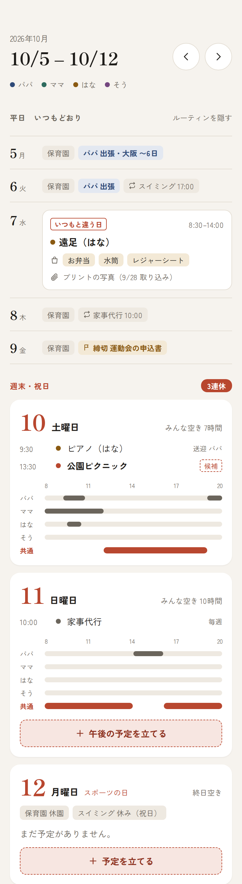
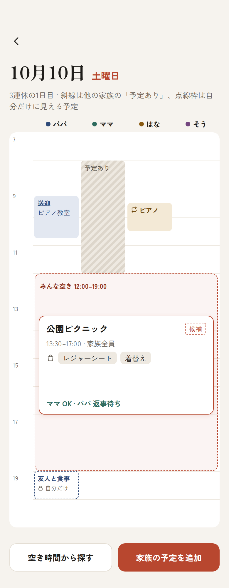
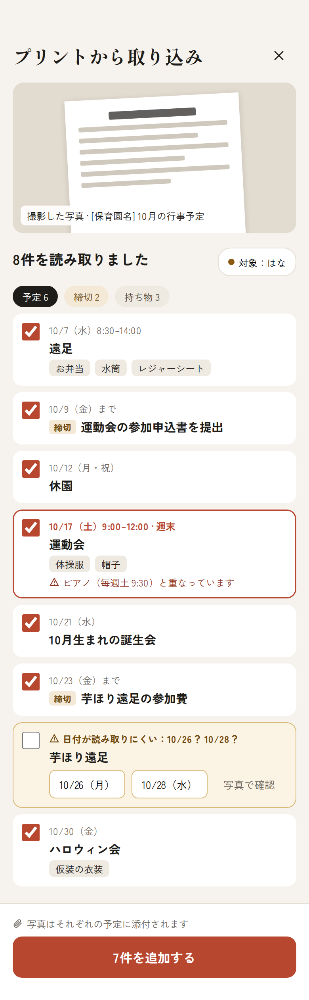

# Danran（だんらん）

> 平日はルーティン、週末は家族の時間。家族のための予定共有 PWA。

Danran は、小さな子どもがいる共働き家庭向けの予定共有アプリです。TimeTree のような「予定を等しく並べるカレンダー」ではなく、**ルーティンは背景に沈め、週末・祝日・いつもと違う日を前景に出す**ことで、家族の時間を計画しやすくします。

## 主な機能（構想）

- **平日小・週末大のレイアウト**：平日は1行に畳み、土日祝や「いつもと違う日」だけを大きく表示する
- **繰り返し予定**：習い事や家事代行などを管理し、祝日スキップ・振替・この回だけ休む、に対応する
- **プリント撮影 → 予定化**：保育園のお知らせを撮影すると、予定・締切・持ち物を抽出し、確認のうえ一括登録する（写真は各予定に添付）
- **Google Calendar 連携**：各自の個人カレンダーは free/busy だけを共有し、家族の予定は専用の共有カレンダーに保存する
- **やること**：予定に紐づく TODO（締切・準備・持ち物）を担当者つきで管理する
- **週1の公開まとめ**：家族の時間と重なる個人予定を、日曜夜にまとめて「家族に公開するか」提案する

## 画面イメージ

| 週ビュー | 週末の1日 | プリント取り込み |
|---|---|---|
|  |  |  |

繰り返し予定・やること・週1まとめを含む全画面は [docs/mocks/](docs/mocks/) と [docs/02-screens.md](docs/02-screens.md) を参照。配色は暫定（もっとポップにする予定）。

## ドキュメント

| ファイル | 内容 |
|---|---|
| [AGENTS.md](AGENTS.md) | コーディングエージェント（Codex 等）向けの作業ルール |
| [docs/01-concept.md](docs/01-concept.md) | プロダクトコンセプト・原則・用語集 |
| [docs/02-screens.md](docs/02-screens.md) | 画面仕様（デザインモックの文章化） |
| [docs/03-architecture.md](docs/03-architecture.md) | 技術構成・データモデル・Google 連携・プリント取り込み |
| [docs/04-hosting.md](docs/04-hosting.md) | ホスティング候補の比較と推奨 |
| [docs/05-implementation-plan.md](docs/05-implementation-plan.md) | フェーズ別の実装計画と受け入れ基準 |
| [docs/06-decisions.md](docs/06-decisions.md) | 決定事項ログと未決事項 |
| [docs/07-pwa-verification.md](docs/07-pwa-verification.md) | PWA 検証手順書（自動テスト・Lighthouse基準・iOS Safari手順） |
| [docs/08-deployment.md](docs/08-deployment.md) | CI/CD・デプロイ運用手順書（GitHub Actions、環境構成、マイグレーション、復旧） |
| [docs/09-ui-foundation.md](docs/09-ui-foundation.md) | デザイントークンと汎用 UI 部品（UI Foundation）の仕様・利用例 |
| [docs/10-authentication.md](docs/10-authentication.md) | 認証・Google OAuth 連携仕様（エンドポイント、Cookie、暗号化、手動確認） |
| [docs/11-google-calendar-client.md](docs/11-google-calendar-client.md) | Google Calendar REST クライアント仕様（10メソッド、リトライ、サニタイズ、プライバシー） |
| [docs/12-time-and-layout.md](docs/12-time-and-layout.md) | 日時・祝日・週レイアウト仕様（Asia/Tokyo 日付計算、連休延長、dayLayout、休園日） |

## 前提条件

- **Node.js**: `^22.12.0 || >=24.0.0`（Node 22.12+ または Node 24+、開発検証環境: `v24.21.0`）
- **pnpm**: `12.6.0`（Corepack 経由での利用を推奨: `corepack enable`）

## 開発と動作確認

### 1. 依存関係とブラウザのセットアップ

```bash
# 依存関係のインストール
pnpm install

# Playwright ブラウザ（Chromium）のインストール（E2E初回時）
pnpm exec playwright install chromium

# PWA 仮アイコンの生成（lucide-react ＋ sharp）
pnpm pwa:icons
```

### 2. D1 データベース（ローカル環境）のマイグレーション適用

Danran は Cloudflare D1（SQLite）および Drizzle ORM を採用しています。
リポジトリのクローン後や更新時は、コミット済みのマイグレーションをローカル D1 に適用して開発を始めます。

```bash
# ローカル D1 データベース（danran-local）にマイグレーションを適用
pnpm db:migrate:local
```

※ スキーマ（`src/worker/db/schema.ts`）を編集したときのみ、`pnpm db:generate` を実行して新しいマイグレーション SQL を生成します（普段の開発開始ごとの実行は不要です）。

> **環境とマイグレーションのコマンド体系**:
> - `wrangler.jsonc` のルート設定はデフォルトのローカル環境（`danran-local`、センチネル UUID `00000000-0000-0000-0000-000000000000`、`remote: false`）です。
> - staging 環境へのマイグレーション適用は明示的に環境フラグを指定する `pnpm db:migrate:staging`（`--env staging --remote`）で行います。
> - production 環境へのマイグレーション適用は明示的に環境フラグを指定する `pnpm db:migrate:production`（`--env production --remote`）で行います。
> - シークレット情報の雛形は `.dev.vars.example` に記載されています（ローカル DB やヘルスチェックテストには `.dev.vars` の作成は不要です）。

### 3. 開発サーバーと各種検証コマンド

```bash
# 開発サーバー起動（Vite ＋ Worker 統合環境、ローカル永続 D1 を参照）
# ※ 起動中、ローカル環境限定で http://localhost:5173/dev/ui にて部品一覧（ショーケース）を確認できます
pnpm dev

# 型チェック（TypeScript strict）
pnpm typecheck

# 静的解析・フォーマットチェック（Biome）
pnpm lint

# ユニット・Worker 統合テスト実行（Vitest / @cloudflare/vitest-pool-workers）
# ※ Miniflare 上でマイグレーションが自動適用され、合成データで D1 / R2 バインディングがテストされます
pnpm test

# 本番ビルド（フロントエンド dist/client ＋ Worker、ローカルプレビュー用）
pnpm build

# 環境別ビルド（Vite の CLOUDFLARE_ENV 指定）
pnpm build:staging
pnpm build:production

# 本番成果物のローカルプレビュー
pnpm preview

# E2E ブラウザテスト実行（Playwright / Chromium）
pnpm e2e
```

## ステータス

Phase 0 基盤（タスク 0-1 雛形、タスク 0-2 PWA・オフライン対応、タスク 0-3 D1 ＋ Drizzle、タスク 0-4 CI/CD、タスク 0-5 デザイントークンと基本部品）：
- この雛形のローカル動作確認および E2E テストには Cloudflare / Google アカウントや Secret は不要です。
- PWA の自動検証（Chromium CDP インストール性・SW制御・オフライン動作）はローカル環境で確認済みです。
- タスク 0-4（PR #4、コミット `b2137cda`）は main にマージされ、GitHub Actions CI/CD による staging デプロイ（公開 URL: `https://danran-staging.tak-ikemachi.workers.dev`）が成功しました。
- staging 環境における HTTPS SPA・ディープリンク、ヘルスチェックおよび API 404 JSON 応答、390px レンダリング、コンソールエラー皆無、CDP インストール性、SW による公開アセット限定キャッシュ（API 非キャッシュ）、オフライン再読み込み・回復、および Lighthouse 11.7.1 PWA 100 点（6つの自動チェック）の通過を確認済みです（iOS 実機確認待ち、production 未デプロイ）。
- D1 スキーマ（初期 `users` テーブル）、Drizzle 設定（`drizzle.config.ts`）、マイグレーションコマンド、R2 バインディング（`PHOTOS`）、`.dev.vars.example` を配備。
- `@cloudflare/vitest-pool-workers` による Worker 統合テスト（7件）で D1 マイグレーション適用、CRUD 操作、制約検証、R2 疎通を確認しています。
- デザイントークン（`tokens.css`）と Tailwind CSS v4 連携、汎用 UI 部品（`Card`, `Chip`, `MemberDot`, `Segmented`, `IconButton`, `TabBar`）、開発専用カタログ（`/dev/ui`、本番ビルドから完全除外）を実装（[docs/09-ui-foundation.md](docs/09-ui-foundation.md)）。
- Phase 1 ログイン・家族・週ビュー：
  - **タスク 1-1（Google OAuth 2.0 連携）**: 実装完了。合成モック・暗号化・D1 トランザクション・CSRF 防御の自動テスト、およびローカル永続化（ブラウザ・サーバー再起動）検証済み。実 Google 同意画面連携・Secrets 登録は人間待ち（UNVERIFIED）。
  - **タスク 1-2（Google カレンダー REST クライアント実装）**: 実装完了（[docs/11-google-calendar-client.md](docs/11-google-calendar-client.md)）。10 メソッド（`calendars.insert`, `acl.insert`, `events.list/get/insert/patch/delete/instances`, `calendarList.list`, `freeBusy.query`）、Zod 入出力境界検証、429/5xx 指数バックオフ、単一 401 トークン更新、非冪等作成の 5xx 即時フェイルクローズ、workerd redirect: manual 制御、エラーサニタイズ、および D1 暗号化トークン復号を含む Worker 統合テストを配備。
  - **タスク 1-3（スパイク：家族カレンダー共有方法）**: Google 認証情報・実アカウント設定待ち（BLOCKED）。
  - **タスク 1-4（家族の作成・参加）**: タスク 1-3 の検証結果待ち（BLOCKED）。
  - **タスク 1-5（時間・祝日・レイアウトのドメインロジック）**: 実装完了（[docs/12-time-and-layout.md](docs/12-time-and-layout.md)）。Asia/Tokyo 固定の日付計算、@holiday-jp/holiday_jp による祝日判定（1970–2050）、月曜起点・祝日連続延長週範囲、dayLayout（週末カード/展開平日/畳み込み平日）、および休園日（`closure_days`、Task 1-4 前のため FK なし論理参照）Drizzle スキーマ・Zod バリデーション・テストを配備。ローカルマイグレーション適用および 4 つのホストタイムゾーン（UTC, Asia/Tokyo, America/New_York, Pacific/Auckland）検証を通過。
  - **次のタスク**: タスク 1-3（実 Google 認証情報設定後の共有検証）→ タスク 1-4（家族の作成・参加）→ タスク 1-6（週表示 API。タスク 1-4 の家族モデル・所有権に依存）。
