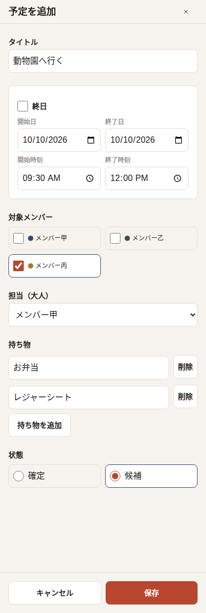
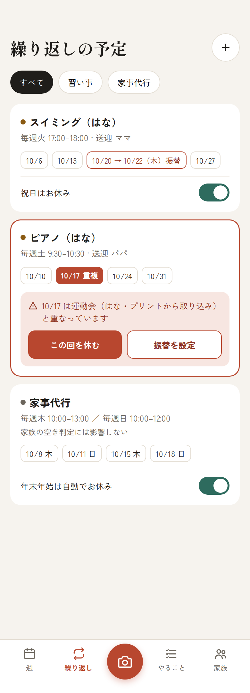
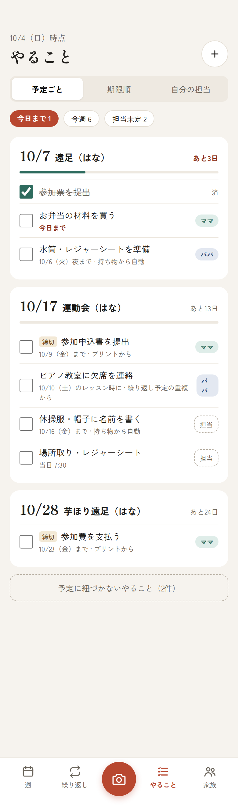
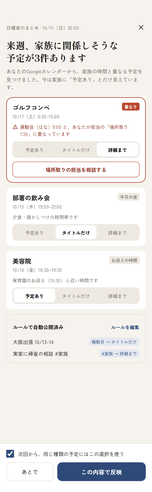

# 02. 画面仕様

デザインモック（Claude Design のキャンバス、非公開）を文章に起こしたもの。モックの画像は [docs/mocks/](mocks/) にある（390px 幅・2倍解像度）。**画像は雰囲気と配置の参考で、レイアウトと振る舞いはこの文書を正とする**（食い違ったら文書に従う）。見た目（配色・書体）は暫定で、もっとポップな方向に振る予定（下の「ビジュアル」参照）。

対象はスマホ幅（390px 基準）の PWA。アプリの共通コンテンツは画面幅いっぱいに広がり、左右に既存の spacing トークン分の余白を取る。最大幅は `--app-max-width`（480px）とし、それより広い画面ではコンテンツを中央寄せにする。タブバーの背景と上罫線は画面幅いっぱいにし、項目列だけを同じ最大幅で中央寄せする。

## 共通

### タブバー（画面下部、5項目）

| 位置 | ラベル | 遷移先 |
|---|---|---|
| 1 | 週 | [S1 週ビュー](#s1-週ビュー) |
| 2 | 繰り返し | [S4 繰り返し予定](#s4-繰り返し予定) |
| 3（中央・大きい丸ボタン） | 撮影（アイコンのみ、`aria-label="プリントを撮影"`） | [S3 プリント取り込み](#s3-プリント取り込み)（カメラ起動） |
| 4 | やること | [S5 やること](#s5-やること) |
| 5 | 家族 | 設定・メンバー管理 |

### メンバー色

各メンバーに中立的な固有色を割り当て、予定の丸ドットや担当チップに使う。性別や続柄（パパ・ママ等）ではなく、8色の中立パレットから選択する（オーナー既定＝藍、参加者既定＝深緑、追加メンバー＝パレット順）。

| 色識別子 | 日本語名 | 用途・既定 |
|---|---|---|
| `indigo` | 藍 | オーナーの既定色 |
| `green` | 深緑 | 参加者の既定色 |
| `ochre` | 黄土 | メンバーパレット |
| `purple` | 紫 | メンバーパレット |
| `coral` | 珊瑚 | メンバーパレット |
| `teal` | 青緑 | メンバーパレット |
| `rose` | 薔薇 | メンバーパレット |
| `slate` | グレー | メンバーパレット |

### 予定の見え方（3種類）

| 種類 | 表示 | データ元 |
|---|---|---|
| 家族予定 | メンバー色の薄い背景＋タイトル | 家族カレンダー |
| 他の家族の個人予定（非公開） | 斜線パターンのグレー＋「予定あり」 | 各自の個人カレンダーの free/busy |
| 自分の個人予定 | 白背景＋メンバー色の点線枠＋タイトル＋鍵アイコン＋「自分だけ」 | 自分の個人カレンダー |
| 他の家族の個人予定（公開済み） | 家族予定と同じ見た目（公開粒度に応じてタイトルのみ／詳細） | 家族カレンダーへのコピー |

## S1. 週ビュー

アプリのホーム。1週間（月〜日＋直後の祝日で連休になる場合はそこまで）を縦スクロールで表示する。

### Phase 1（タスク 1-9）の表示範囲

家族カレンダー上の家族予定を表示する。個人カレンダーへの問い合わせや「公開済みの個人予定」専用 UI は行わない。平日は API の `layout` に従って compact／expanded を表示し、週末・祝日は予定リストと休園チップを表示する。ルーティン非表示は予定だけを隠し、API が返した日ごとのレイアウトは変えない。ただし、表示対象の予定が0件の expanded 日は空の展開カードを避け、compact 行として表示する。

`source: "publish"` の予定も、家族カレンダー上の家族予定として通常どおり表示する。本人の個人予定は Task 2-1 で別 API から本人の画面だけに追加する。公開判断専用 UI は Phase 6 の対象であり、Phase 1 の家族週 API は引き続き家族カレンダーだけを読む。

この段階では free/busy、「みんな空き」の時間数とタイムライン、締切、添付写真、S2 詳細画面への遷移は表示しない。家族カレンダー上の単発予定は週画面から作成・編集・削除できる。タブの「繰り返し」「撮影」「やること」は「準備中」と案内する。

### Phase 2（タスク 2-1）の本人の個人予定

本人が `/family` で有効化し、本人の Google アカウントで同意した個人カレンダーだけを本人の S1 に重ねて表示する。未同意・未選択なら個人予定は表示せず、個人予定 API の取得失敗は家族予定表示に影響させない。他の家族の個人予定をこのタスクで取得・表示することはない。

- 個人予定は白背景、本人のメンバー色の点線枠、タイトル、鍵アイコン、「自分だけ」で表示し、選択・編集のボタンにはしない。
- compact の平日は最大2件を表示し、残りは「ほか N 件」で開く日別一覧にまとめる。個人予定の件数では日ごとのレイアウトを変えない。
- expanded と週末・祝日カードでは家族予定と時刻順に並べる。ルーティン非表示は繰り返しの個人予定にも適用する。
- personal-week の取得が失敗した日は、家族予定を残したまま個人予定欄に固定の控えめな案内を表示する。

### Phase 2（タスク 2-5）の週末・祝日タイムライン

週末・祝日カードに、8〜20時のメンバー別タイムラインと最下段の「共通」行を表示する。バーは装飾とし、各行に埋まっている時間の読み上げ文を付ける。メンバー順は凡例と同じ。`getFreeWindows` の既定値を使い、30分未満の共通の空きは除き、合計は30分単位で切り捨てて「みんな空き N時間」と表示する。共通の空きが0分なら「みんな空きなし」とする。

- `ready` の大人と子どもは、個人 busy（大人は取得済み分のみ）と対象となる家族予定を含む各行を表示し、共通の空きの計算にも含める。
- `not_shared` の大人は家族予定だけを行と共通の計算に含め、「個人の予定は未共有」と行に添える。少なくとも1人が未共有なら「個人の予定を共有していない人がいます」と案内する。本人が未共有の場合は「家族」ページへのリンクを表示する。
- `unavailable` の大人は busy バーを表示せず「取得できませんでした」と示す。1人でもこの状態なら「みんな空き」と共通行を隠し、「空き状況を取得できない人がいるため、共通の空きは表示していません」と案内する。`busy: []` の `unavailable` / `not_shared` を予定なしと解釈しない。
- `/week/busy` が読み込み中・失敗中も家族予定と本人の個人予定を表示し続ける。失敗はタイムライン欄だけに「空き状況を読み込めませんでした」と表示する。週切替中は前週の busy を新しい週へ表示せず、週応答と表示週が一致するときだけ使う。
- ルーティンを隠す設定は予定表示だけに適用し、busy の計算対象となる家族イベントは変えない。計算例外はその日のタイムラインだけを「表示できません」にする。
- タイムラインは週末・祝日カードだけに出し、平日の行と「いつもと違う日」カードには出さない。390px 幅で長い名前は省略し、バーの最小幅を保つ。445px 幅でも横にはみ出さない。

**ヘッダー**：年月（同じ年で月をまたぐ週は「2026年9月〜10月」、年をまたぐ週は「2026年12月〜2027年1月」）、期間（例「10/5 – 10/12」）、前週・次週ボタン、メンバーの凡例（大人、子どもの順。同じ種別内は並び順と ID で安定化）。週切り替え中は現在表示中の週を残して控えめな読み込み表示を出し、取得に失敗した場合はその週の予定を消してエラー案内を表示する。

**平日セクション**（見出し「平日 いつもどおり」、右に「ルーティンを隠す」トグル）
- 1日1行（高さ約52px）。左に日付と曜日、右にチップを横並び。
  - ルーティン：グレーのチップ（例「保育園」「スイミング 17:00」＋繰り返しアイコン）
  - 締切（Phase 5）：黄土色のチップ＋旗アイコン（例「締切 運動会の申込書」）
  - 公開済みの個人予定（Phase 6）：メンバー色のチップ（例「メンバー名 出張・大阪 〜6日」）
  - その日に表示する予定がない場合は「予定なし」を画面に出さず、日付と曜日だけの低い行にする。「予定なし」の説明はスクリーンリーダー向けに残す。
- **いつもと違う日**は行がカードに展開される。
  - 「いつもと違う日」ラベル、時間、タイトル（メンバー色ドット付き）
  - 持ち物チップ（バッグアイコン）
  - 添付：「プリントの写真（9/28 取り込み）」（クリップアイコン）
  - API の layout が `expanded` でも、画面上に表示する予定が 0 件なら compact 行に戻す。

**週末・祝日セクション**（見出しはアクセント色。連休なら「3連休」バッジ）
- 1日1枚の大きなカード。
  - 日付（大きな数字）、曜日、祝日名（あれば）、右に「みんな空き N時間」（Task 2-5）。共通の空きが0分なら「みんな空きなし」。
  - 家族予定のリスト：時刻／メンバー色ドット／タイトル／補足（「担当者名」「候補」「繰り返し」など）
  - **空きタイムライン（Task 2-5）**：8〜20時の横バーを大人・子ども全員分並べ、各自の埋まっている時間を濃いグレーで塗る。最下段の「共通」行に、全員空いている区間をアクセント色で示す。メンバー状態別の表示と注記は上記「Phase 2（タスク 2-5）」に従う。
  - 保育園休園・習い事休みなどのステータスチップ（祝日の場合）
  - 「午後の予定を立てる」「予定を立てる」の点線ボタンから S2 を開く動作は今後の検討事項。Task 2-6 の入口は「この日を詳しく見る」リンクに限る。
- 「この日を詳しく見る」リンクで [S2](#s2-週末の1日) へ遷移する。カード全体と平日の行はリンクにしない。
- ヘッダーに「予定を追加」ボタンを置き、各日には枠や文字のない44px以上の「＋」ボタンを置く。aria-label は日付入り（例「10月6日に予定を追加」）とし、押すとその日を初期値にしたフォームを開く。空の compact 行は行高を最小44pxにし、隣の日のタップ領域と重ならないようにする。
- 週末・祝日カードでは連休バッジを日付の並びの左側に置き、日付行の右端に同じ「＋」ボタンを置く。
- 家族予定を選ぶと作成・編集ダイアログを開く。繰り返し予定を選んだ場合は「繰り返し予定の変更は準備中」と案内し、編集を開始しない。

### 予定の作成・編集ダイアログ（タスク 1-8）

- ネイティブの全画面 `<dialog>` で、タイトル、終日、日付または開始・終了時刻、対象メンバー、担当、持ち物、候補／確定を編集する。
- 日付の初期値は呼び出し元の日（指定がなければ今日）、時刻の初期値は次の正時から1時間。終日は Google Calendar の排他的終了日で保存する。
- 対象メンバーは複数選択でき、担当は大人1人または未指定。メンバーの色ドットに加えてラベルでも識別する。
- 持ち物は最大20件、各項目は前後の空白を除いて最大100文字。タイトルは前後の空白を除いて1〜200文字。
- 保存・削除中は操作を無効にする。失敗時は入力を残し、固定の日本語案内を表示する。削除前には画面内で確認する。
- Escape またはブラウザの戻る操作で閉じる。開いたときはフォームへフォーカスし、閉じたときは起動元へ戻す。ダイアログ表示中は PWA 更新を保留する。
- 繰り返し予定の編集・削除、添付、説明、場所、空き時間からの作成は対象外。

## S2. 週末の1日

`/day/YYYY-MM-DD` の1日詳細。ログイン済みで準備済み家族がある場合に表示する。日付と週の計算は `Asia/Tokyo` で行う。S1 の週末・祝日カードにある「この日を詳しく見る」リンク、または URL から開く。URL を直接開けば平日も表示できる。

- ヘッダーに戻るボタン、日付・曜日、取得した週の休日情報、凡例の説明文「斜線はほかの家族の『予定あり』、点線枠は自分だけに見える予定」を表示する。戻るとその日を含む元の S1 の週へ戻る。
- **メンバー列のタイムライン**：7〜21時を縦軸にし、1時間を48pxで表す。横に週ビューと同じ順序でメンバー列を並べる。列幅は全メンバーで同じにする。4人以下は時刻軸を除いた幅を等分し、390px幅で全列と見出しを横スクロールなしで表示する。5人以上は列の最小幅を保ち、タイムライン領域だけを横スクロールさせる。ページ全体は横スクロールさせない。タイムライン下端には21時の目盛りを読める余白を設ける。
  - 確定した家族予定は対象メンバーの列に、メンバー色の薄い背景とタイトルで表示する。対象が全員の場合は背景を全列にまたがる1ブロックにし、背景には中立な `--chip` 色を使う。開始直後に重なるカードがある場合はタイトルを、その時間帯で最も広く連続して空いているメンバー列に置く。候補予定は幅にかかわらず破線枠にし、カード内の表示領域が目安120px未満なら「候」の印も表示して、最小幅でも色以外に候補と分かる手がかりを残す。カード内の表示領域が目安120px以上なら「候補」、時間、対象（対象指定なしは「家族全員」）、持ち物、担当（設定時）を表示し、それより狭い領域では詳細を省略して読み上げ用一覧と選択時のダイアログで確認できるようにする。同じ列で予定が重なる場合は幅を分け合い、列幅は広げない。カード内の表示領域が狭い場合はタイトルを省略表示し、時刻や対象メンバーはカード内に出さない。完全な内容は読み上げ用一覧と選択時のダイアログで確認できる。
  - 担当者は余裕時間0分で担当列にも「担当」と表示する。担当者が対象メンバーなら同じブロックにラベルを添える。繰り返し予定はアイコンで示す。
  - ほかの家族の個人予定は busy API が返した区間だけを斜線の「予定あり」で表示する。タイトル、calendar ID、件数などは表示しない。
  - 自分の列には家族 busy と「予定あり」に加え、自分の個人予定を点線枠、鍵アイコン、「自分だけ」、タイトル付きで表示する。本人以外の個人予定の内容は表示しない。
  - `not_shared` は列の上に「個人の予定は未共有」と表示し、家族予定だけで共通の空きを計算する。`unavailable` は「取得できませんでした」と示して個人 busy の斜線を出さず、共通の空きも表示しない。
- 終日の家族予定と本人の終日個人予定はタイムラインの上に出す。7時前または21時以降だけの家族予定と本人の個人予定は下の一覧に出し、時間帯をまたぐ予定は軸の端で切って表示する。
- **共通の空き**：S1 と同じ8〜20時を `getFreeWindows` で計算し、全列にまたがる点線枠と薄いアクセント色の帯、時刻入りラベルを表示する。ラベルは帯の左上に小さく置き、カードより後ろに重ねる。家族予定、候補、自分だけの予定の文字がラベルに隠れないようにする。`not_shared` がいれば未共有の案内を添える。`unavailable` が一人でもいれば帯を隠し、取得不能のため共通の空きを出さない案内を表示する。
- 共通の空き帯は本物のボタンにし、押すとその日・帯の開始時刻から1時間（残りが1時間未満なら帯の終わりまで）の家族予定作成ダイアログを開く。下部の「家族の予定を追加」は同じ日の通常初期値で開き、「空き時間から探す」は最初の共通空きへ移動してフォーカスする。共通空きがない、または表示できないときは後者を無効にして理由を示す。
- 家族予定・候補のカードを選ぶと既存の編集ダイアログを開く。繰り返し予定は編集せず、「繰り返し予定の変更は準備中」と案内する。予定の作成・編集・削除は S1 にも反映する。
- 家族週 API の失敗時は S1 と同じ再試行可能な案内を出す。personal/busy API の失敗・遅延はタイムライン上の案内に留め、家族予定と追加操作を続けられるようにする。読み上げ用にメンバーごとの予定と共通空きを文章でも用意する。

Task 2-6 では候補への返事、添付、締切、ドラッグによる時刻変更、帯の任意位置を使った作成は扱わない。S1 のカード全体をリンクにせず、明示リンクだけで S2 を開く。

## S3. プリント取り込み

撮影後に開くモーダル。

1. 撮影した写真のサムネイル＋キャプション（推定されたタイトル、例「[保育園名] 10月の行事予定」）
2. 見出し「8件を読み取りました」、右に対象の子ども選択（推定。例「対象：はな」）
3. 種類別の件数ピル：「予定 6」「締切 2」「持ち物 3」
4. 抽出結果のリスト（各行にチェックボックス。既定はオン）
   - 予定：日付・時間、タイトル、持ち物チップ
   - 締切：「締切」ラベル＋内容、「〜まで」
   - お休み：休園など
   - 週末にかかる予定は強調枠＋「週末」ラベル
   - **既存予定との重複**：警告アイコン＋「ピアノ（毎週土 9:30）と重なっています」
   - **読み取りが怪しい項目**：黄色系の背景、チェックは既定オフ、「日付が読み取りにくい：10/26？ 10/28？」＋候補ボタン（2つ）＋「写真で確認」
5. フッター：「写真はそれぞれの予定に添付されます」＋主ボタン「N件を追加する」

## S4. 繰り返し予定

- ヘッダー：タイトル、追加ボタン、フィルタ（すべて／習い事／家事代行）
- 繰り返し予定のカード：
  - タイトル（対象メンバー色ドット）、ルール（「毎週火 17:00–18:00 · 送迎 ママ」）
  - 直近4回の日付チップ。例外は色付きで表示する（「10/20 → 10/22（木）振替」、「10/17 重複」）
  - 設定トグル：「祝日はお休み」「年末年始は自動でお休み」
  - **重複の解決パネル**（重複がある場合のみ）：「10/17 は運動会（はな・プリントから取り込み）と重なっています」＋「この回を休む」「振替を設定」
  - 家事代行など人が関与しない予定は「家族の空き判定には影響しない」と明示する

## S5. やること

- ヘッダー：基準日、タイトル、追加ボタン
- 切り替え（セグメント）：「予定ごと」（既定）／「期限順」／「自分の担当」
- サマリーピル：「今日まで N」（強調）、「今週 N」、「担当未定 N」
- **予定ごとのグループ**：
  - 見出し：予定の日付・タイトル・対象、右に「あと N日」（3日以内は強調色）
  - 進捗バー（完了数 / 総数）
  - TODO 行：チェックボックス、内容、期限と発生元（「10/9（金）まで · プリントから」「持ち物から自動」「繰り返し予定の重複から」）、担当チップ（未定なら点線の「担当」ボタン）
- 最後に「予定に紐づかないやること（N件）」の折りたたみ

## S6. 週1の公開まとめ

日曜20時の通知から開く。

- ヘッダー：「日曜夜のまとめ · 日時」、閉じる、見出し「来週、家族に関係しそうな予定が N件あります」、説明文
- 提案カード（1件ずつ）：
  - 個人予定のタイトル・日時
  - 理由バッジ：「重なり」（強調色）／「平日の夜」／「お迎えの時間」など
  - 理由の説明（例：「運動会（はな）9:00 と、あなたが担当の『場所取り 7:30』に重なっています」）
  - 見え方のセグメント：「予定あり／タイトルだけ／詳細まで」。おすすめの値をあらかじめ選択しておく。
  - 重なりの場合、「場所取りの担当を相談する」ボタン（TODO の担当変更へ）
- 「ルールで自動公開済み」セクション：項目と適用されたルール（「複数日 → タイトルだけ」「#家族 → 詳細まで」）、「ルールを編集」
- フッター：「次回から、同じ種類の予定にはこの選択を使う」チェック（既定オン）、「あとで」、主ボタン「この内容で反映」

## その他の画面と後続機能の仕様

- **オンボーディング**：Google でログイン → 家族を作成 or 招待リンクで参加 → 家族カレンダー作成 → 子どもの追加（名前・色）
- **家族（設定）**：active メンバーを API の並び順で一覧にし、表示名と色を編集する。色は8色のパレットから選び、色名も表示する（`slate` の表示名は「グレー」）。active な大人なら誰でもメンバー名・色と休園日を管理できる。子どもの追加・削除と招待発行はオーナー限定で `/onboarding` に残す。休園日は今日以降の一覧と追加フォーム（開始・終了日、ラベル、対象メンバー）を表示し、両端を含む最大31日を登録できる。対象メンバーを選ばない場合は家族全員に適用する。各行は確認を挟んで削除し、休園日は週ビューのカードとラベルに反映する。「自分の予定の表示」では、追加同意後に本人のカレンダー一覧を選択できる。選択は本人用で、家族へ予定内容を共有しない。「空き状況の共有」では別途追加同意を得て、予定のある時間帯だけを共有し、タイトルや内容は家族に見せない。カレンダーを最大10件まで本人が選ぶ。選択肢は初期状態ですべて未選択とし、「現在、空き状況は共有していません。共有するカレンダーを選んで保存してください。」と案内する。保存済み選択がない状態で何も選ばれていなければ保存を無効にする。会社のカレンダーを一覧に出す方法と、外部共有が管理者に禁止されている場合は利用できないことも説明する。公開ルール、通知設定は後続タスクの対象。
- **予定の作成・編集**：タイトル、日時、対象メンバー、担当（送迎）、持ち物、候補／確定、繰り返し、添付
- **予定の詳細**：添付写真の表示を含む

## ビジュアル（暫定）

モックは和紙系の落ち着いたトーンだったが、本番はもう少しポップにする方針。実装初期はデザイントークンを CSS 変数にまとめ、後から差し替えられるようにしておく。

| トークン | モックの値 | 用途 |
|---|---|---|
| `--bg` | `#F6F3EE` | 画面背景 |
| `--surface` | `#FFFFFF` | カード |
| `--ink` | `#1F1D1A` | 本文 |
| `--muted` | `#6B655C` | 補足テキスト（背景とのコントラスト 4.5:1 以上を維持） |
| `--line` | `#E4DED4` | 罫線 |
| `--chip` | `#EEE9E1` | ルーティンのチップ |
| `--accent` | `#B8472F` | 週末・祝日・主ボタン |
| `--accent-tint` | `#F7E6E1` | アクセントの薄い背景 |
| `--deadline` | `#8A5A12` / `#F3E9D6` | 締切 |

アクセシビリティ要件：タップ領域は44px以上、ボタンは本物の `<button>`、アイコンのみのボタンには `aria-label`、色だけで区別しない（斜線・点線・ラベルを併用する）。
